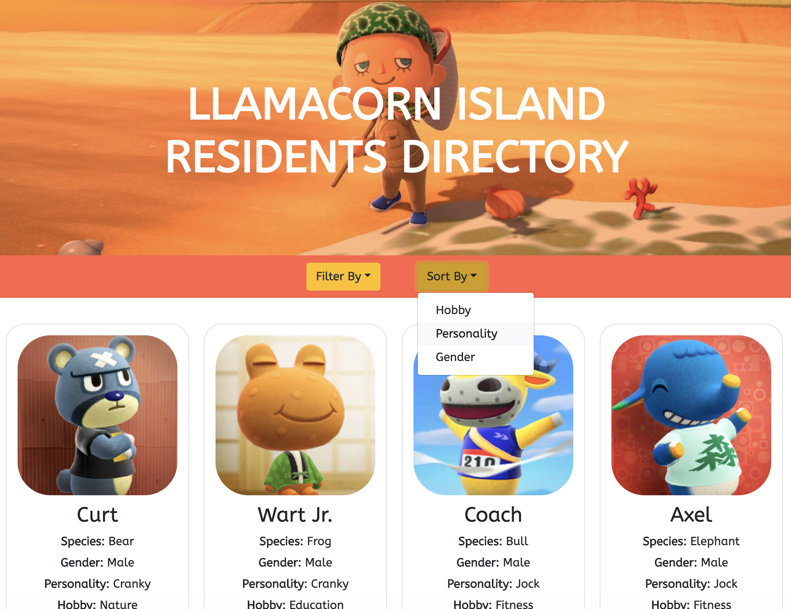

# Employee-Directory

## Description
In this application I am using react to render characters from the Animal Crossing video game and their information. I am using a third party API to get all the information of the characters, the link is listed below under credit. The website allows users to filter and sort through all characters on specific criteria, such as hobby, personality and gender.

The purpose of this project is to practice my newly learned knowledge in React, some of the technologies used to create this project include:

- create React app
- functional and class components
- passing props and states 
- API calls within React

## Link to Deployed Website
https://dilanli.github.io/Employee-Directory/

## Credit
API: ACNH API
A free Animal Crossing: New Horizons API for critters, furniture, villagers and more!
Link: http://acnhapi.com/doc#tag/Villagers